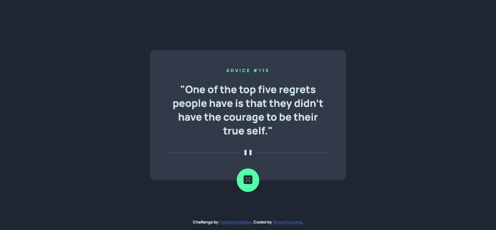
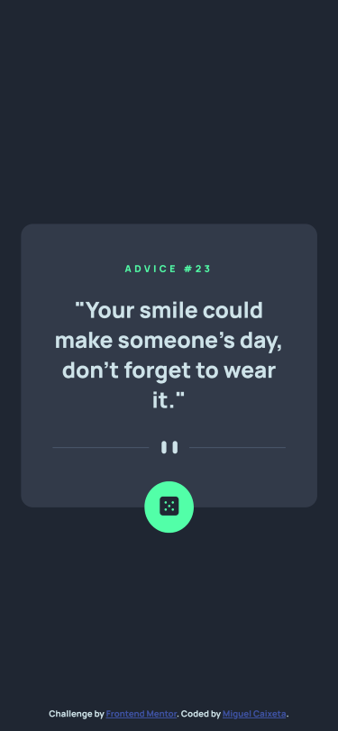

# Frontend Mentor - Advice generator app solution

This is a solution to the [Advice generator app challenge on Frontend Mentor](https://www.frontendmentor.io/challenges/advice-generator-app-QdUG-13db). Frontend Mentor challenges help you improve your coding skills by building realistic projects.

## Table of contents

- [Overview](#overview)
  - [The challenge](#the-challenge)
  - [Screenshots](#screenshots)
    - [Desktop](#desktop)
    - [Mobile](#mobile)
  - [Links](#links)
- [My process](#my-process)
  - [Built with](#built-with)
  - [What I learned](#what-i-learned)
- [Author](#author)

## Overview

### The challenge

Users should be able to:

- View the optimal layout for the app depending on their device's screen size
- See hover states for all interactive elements on the page
- Generate a new piece of advice by clicking the dice icon

## Screenshots

### Desktop



### Mobile



### Links

- Solution URL: [GitHub](https://github.com/MiguellPC/advice-generetor-app)
- Live Site URL: [Add live site URL here](https://your-live-site-url.com)

## My process

### Built with

- Semantic HTML5 markup
- CSS custom properties
- Flexbox

### What I learned

### CSS Media Queries

```css
@media screen and (max-width: 400px) {
  .container {
    width: 330px;
  }
}
```

### JS fetch API and DOM manipulation

```js
const url = "https://api.adviceslip.com/advice";

const adviceID = document.querySelector("#adviceID");
const adviceText = document.querySelector("#adviceText");
const adviceBtn = document.querySelector("#adviceBtn");

const fetchAdvice = () => {
  if (adviceID.innerHTML !== "" && adviceText.innerHTML !== "") {
    adviceID.innerHTML = "";
    adviceText.innerHTML = "";
  }

  fetch(url)
    .then((response) => response.json())
    .then((data) => {
      adviceID.innerHTML = "ADVICE #" + data.slip.id;
      adviceText.innerHTML = '"' + data.slip.advice + '"';
    })
    .catch((err) => console.log(err));
};

fetchAdvice();

adviceBtn.addEventListener("click", fetchAdvice);
```

## Author

- GitHub - [Miguel Caixeta](https://github.com/MiguellPC)
- Frontend Mentor - [@MiguellPC](https://www.frontendmentor.io/profile/MiguellPC)
- Linkedin - [Miguel Caixeta](https://www.linkedin.com/in/miguel-caixeta-39628a118/)
